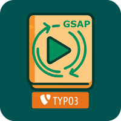
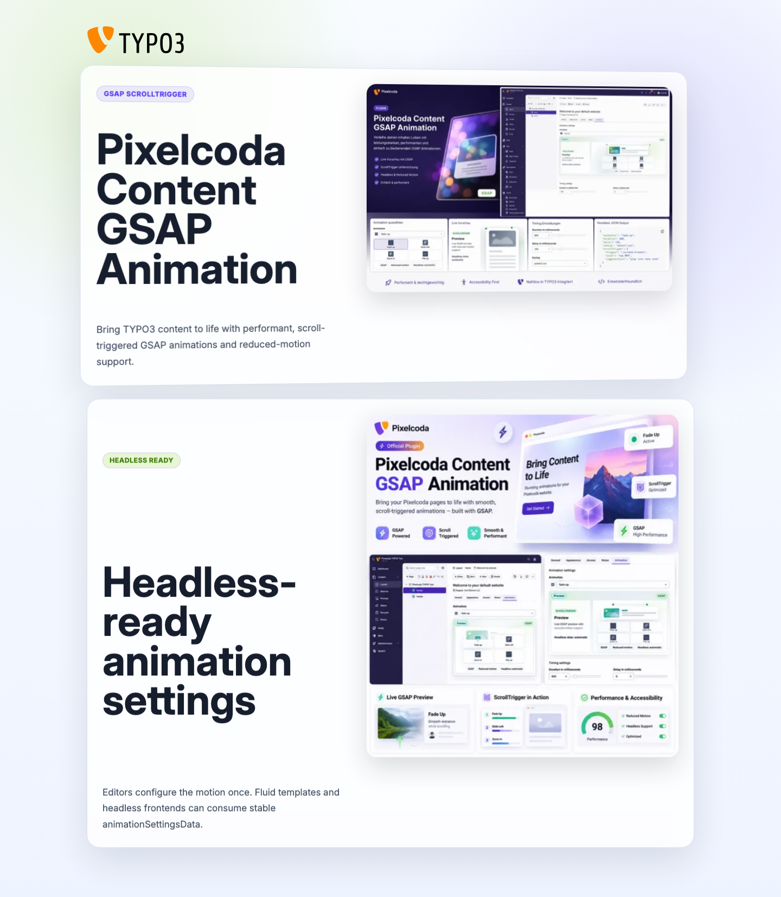
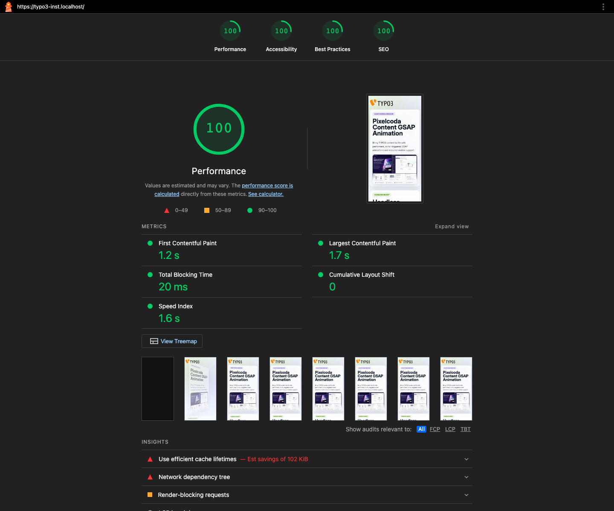

# Content GSAP Animation



GSAP-powered scroll animations for TYPO3 content elements. Editors choose an animation in the content element form; the extension renders the required `data-gsap-*` attributes and initializes GSAP ScrollTrigger in the frontend.


## Highlights

- TYPO3 12.4, 13.4 and 14.3+ compatible within the TYPO3 14 release line
- Fluid Styled Content support
- Bootstrap Package v13, v14 and v15 support
- Fade, slide, zoom and flip animation presets
- Backend preview with duration, delay and easing support
- Full-width premium backend preview with readable dark-mode styling, GSAP GIF preset examples and automatic headless-output indicator
- Extended settings for offset, anchor placement, once and mirror behavior
- BITV-friendly behavior via `prefers-reduced-motion`
- Headless-ready structured animation data for custom renderers and APIs
- Local vendored GSAP and ScrollTrigger assets, no CDN dependency

## Installation

```bash
composer require pixelcoda/content-gsap-animation
```

Then run TYPO3 extension setup:

```bash
vendor/bin/typo3 extension:setup
```

## TYPO3 Setup

For TYPO3 13 and TYPO3 14 projects using Site Sets, add the Site Set dependency:

```yaml
dependencies:
  - pixelcoda/content-gsap-animation
```

For classic TypoScript templates, include the matching setup for your rendering stack:

- `Content GSAP Animation: Fluid Styled Content`
- `Content GSAP Animation: Bootstrap Package v13.x`
- `Content GSAP Animation: Bootstrap Package v14.x`
- `Content GSAP Animation: Bootstrap Package v15.x`

The Bootstrap Package number refers to the Bootstrap Package major version, not the TYPO3 major version.

## Editor Usage

Open a content element and use the **Animation** tab. Select an animation preset and adjust timing. If extended settings are enabled in the extension configuration, editors can also set offset, anchor placement, once and mirror behavior.

The backend preview shows the selected animation on a content-card mockup and displays GIF examples for common presets such as fade, slide, zoom and flip. This helps editors compare the animation possibilities without leaving the form.

Documentation media:

- [Original TYPO3 backend settings flow GIF](Documentation/Images/Settings/backend-settings-animation-flow.gif)
- [Styled frontend demo](Documentation/Images/Reports/frontend-styled.png)
- [Lighthouse 100 report](Documentation/Images/Reports/lighthouse-100.png)
- [Static premium preview](Documentation/Images/Settings/premium-preview.png)
- [Animation tab](Documentation/Images/Settings/animation-tab.png)
- [Extended settings](Documentation/Images/Settings/extended-settings.png)
- [Footer label](Documentation/Images/Settings/footer-label.png)

## Lighthouse





Verified on the local TYPO3 test page with an animated content element and bundled GSAP assets:

- Performance: 100
- Accessibility: 100
- Best Practices: 100
- SEO: 100
- FCP: 1.2 s
- LCP: 1.7 s
- TBT: 20 ms
- CLS: 0

## Accessibility

The frontend script respects `prefers-reduced-motion: reduce`. If the visitor has reduced motion enabled, animation attributes are ignored and elements remain visible without transform or opacity animation.

## Headless Usage

Headless is not an editor setting and there is no toggle to enable it in the content element form. The extension always exposes structured animation data when the data processor is used by the selected TypoScript setup.

The data processor exposes both rendered HTML attributes and structured animation data:

- `animationSettings`: raw HTML attribute string for Fluid layouts
- `gsapAnimationSettings`: legacy raw HTML attribute string
- `animationSettingsData`: structured array for headless/API usage
- `gsapAnimationSettingsData`: legacy structured array alias

Example structured data:

```json
{
  "animation": "fade-up",
  "duration": 800,
  "delay": 0,
  "easing": "power2.out",
  "offset": 120,
  "anchorPlacement": "top-center",
  "once": true,
  "mirror": false
}
```

Custom Fluid layouts can keep using:

```html
{f:if(condition: animationSettings, then: '{animationSettings -> f:format.raw()}')}
```

Headless renderers should consume `animationSettingsData` and decide in the frontend application whether to use GSAP, native CSS, framework-native animation or no animation. Keep the reduced-motion decision in the frontend so API responses stay presentation-neutral.

In short: editors only choose the animation. Integrators consume `animationSettingsData` in custom Fluid layouts, JSON responses, API resources or headless frontend adapters.

## Development

Install PHP dependencies:

```bash
composer update --prefer-dist
```

Build JavaScript bundles:

```bash
cd Resources/Public
yarn install
yarn build
```

Run checks:

```bash
composer test
composer test:functional
```

Functional tests require TYPO3 Testing Framework database credentials. With DDEV, use root credentials so the test runner can create temporary databases.

## Documentation

Full documentation is shipped with the extension:

https://github.com/CasianBlanaru/pixelcoda-content-gsap-animation/tree/main/Documentation

The TYPO3 documentation URL can be enabled once docs.typo3.org has indexed the package.
