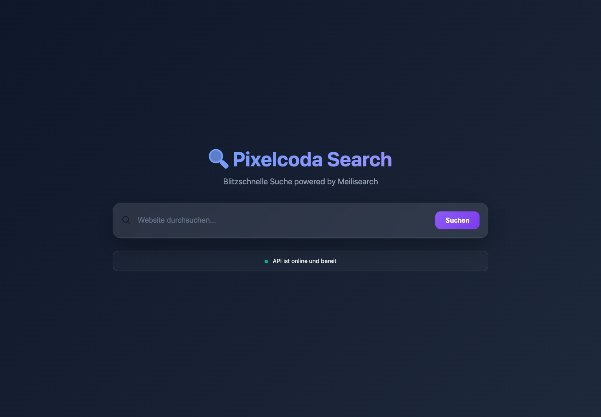

# Pixelcoda Search for TYPO3

Pixelcoda Search provides accessible site search for classic TYPO3 frontends
and headless projects. The same content element supports autocomplete, faceted
filters, JSON output and optional source-grounded AI answers.

Test the complete TYPO3 Suite and Search demo at
https://web-production-e607a.up.railway.app/.

## Frontend search



The classic rendering mode loads the minified frontend assets only when the
Pixelcoda Search content element is present. Keyboard navigation, visible focus
states, status announcements and reduced-motion support are included.

## AI-assisted answers


AI answers are optional. Deployments can use OpenAI, Azure OpenAI, Ollama or
Hugging Face through the provider-independent adapter. Search remains available
when AI answers are disabled.

## Rendering modes

- **Classic:** Fluid-rendered TYPO3 frontend with integrated assets.
- **Headless:** Stable JSON output for React, Vue, Nuxt, Next.js or custom
  clients.

See [Dual mode support](DualMode.md) and [Mode switch](ModeSwitch.md) for the
configuration details.

## Installation

```bash
composer require pixelcoda/typo3-search
vendor/bin/typo3 extension:setup pixelcoda_search
```

Add the **Pixelcoda Search** Site Set dependency, configure the API under
**System > Settings > Extension Configuration > pixelcoda_search**, and add the
**Pixelcoda Search** content element to a page.

## Index content

```bash
vendor/bin/typo3 pixelcoda:search:reindex
vendor/bin/typo3 pixelcoda:search:index --dry-run
```

For DDEV installations, use `http://host.docker.internal:8787` as the
server-side API URL when the API runs on the host machine.

## Backend administration

The module at **Administration > pixelcoda Search** is compatible with TYPO3
12.4 LTS, 13.4 LTS and 14.x. It reads site configuration with TYPO3's YAML
loader, so no optional PHP YAML extension is required.

Use **API-Verbindung testen** to call the configured Search API `/health`
endpoint. A failed check reports the network error in a TYPO3 flash message
without opening a nested backend frame.
