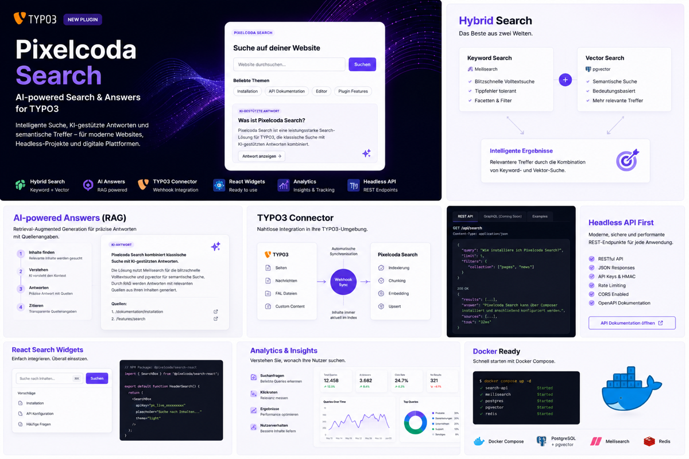
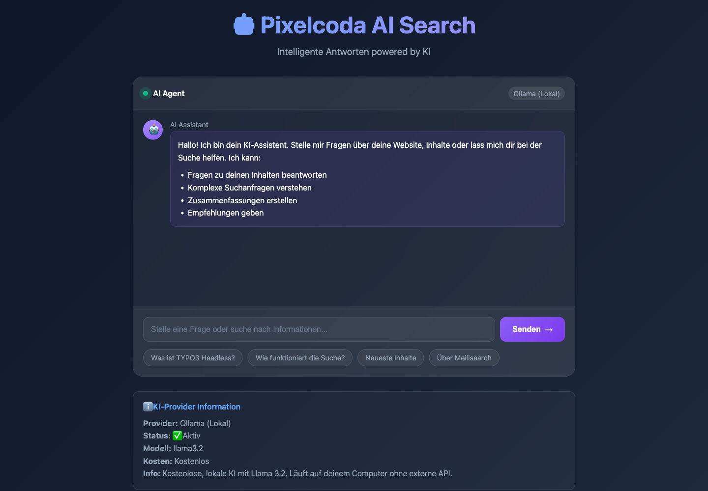

# Pixelcoda Search for TYPO3

Premium TYPO3 Search extension for TYPO3 12.4 LTS, 13.4 LTS and 14.x with
autocomplete, suggestions, pagination, faceted filters, classic Fluid rendering,
headless JSON output, Meilisearch integration and optional AI/RAG answers.



## Screenshots

### Classic TYPO3 search


### AI-assisted answers



The complete platform overview and additional screenshots are available in the
[project README](https://github.com/CasianBlanaru/pixelcoda-typo3-search#screenshots).

## Features

- Autocomplete, suggestions, pagination and faceted filters
- Classic TYPO3 frontend and headless JSON output
- Accessible markup with keyboard and reduced-motion support
- Meilisearch keyword search and optional semantic vector retrieval
- Optional AI-assisted answers with cited search results
- TYPO3 backend module, content element and configurable API credentials

## Installation

```bash
composer require pixelcoda/typo3-search
vendor/bin/typo3 extension:setup pixelcoda_search
```

Add the **Pixelcoda Search** Site Set dependency, configure the API under
**System > Settings > Extension Configuration > pixelcoda_search**, then add
the **Pixelcoda Search** content element to a page.

Full documentation and development setup:
[github.com/CasianBlanaru/pixelcoda-typo3-search](https://github.com/CasianBlanaru/pixelcoda-typo3-search)

Maintained by [Pixelcoda by Casian Blanaru](https://pixelcoda.de).

## Index TYPO3 content

Configure the API URL, project ID, read key and write key in the TYPO3
extension configuration. Then index visible pages and content elements:

```bash
vendor/bin/typo3 pixelcoda:search:reindex
vendor/bin/typo3 pixelcoda:search:index --dry-run
```

The classic frontend content element provides accessible keyword search and an
optional source-grounded AI answer panel. Headless JSON output and existing API
contracts remain available.

For DDEV installations, use `http://host.docker.internal:8787` as the
server-side API URL when the API runs on the host machine.

## Backend module and API check

Open **Administration > pixelcoda Search** to inspect the active rendering
mode and API configuration. **API-Verbindung testen** checks the API's
`/health` endpoint. TYPO3 14 uses the current backend module rendering API;
TYPO3 12.4 and 13.4 remain supported.

The API must be running before the connection test:

```bash
npm run api:dev
curl --fail http://localhost:8787/health
```
